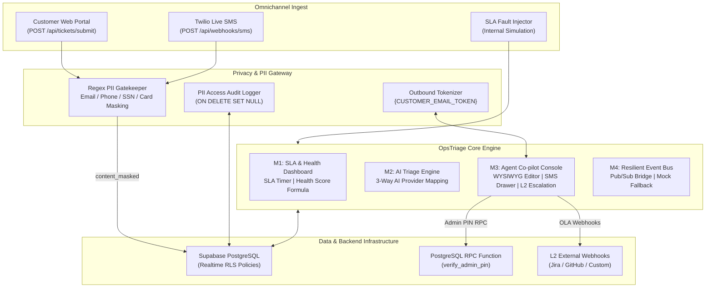
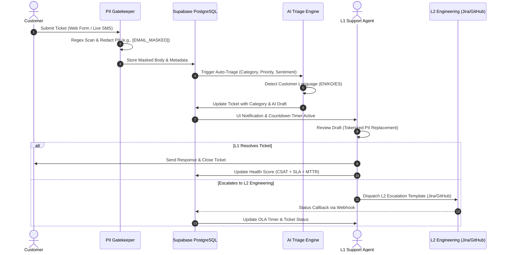
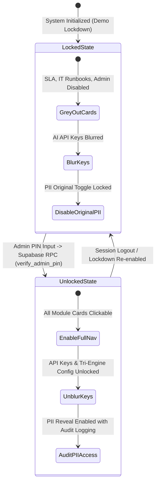

# OpsTriage Live: Production Full-Stack CX Operations & SLA Management Platform

> Production application integrated with Supabase PostgreSQL, real-time RLS, RPC admin security, and privacy-governed AI orchestration.

> **Project Notice**: This repository contains the production full-stack implementation of OpsTriage, integrated with a live Supabase PostgreSQL database and deployed at [https://opstriagelive.vercel.app/](https://opstriagelive.vercel.app/) (QA validation in progress).
> The standalone TypeScript-based demo simulation environment is hosted at [https://ops-triage-demo.vercel.app/](https://ops-triage-demo.vercel.app/).

---

## Executive Business Overview

### Operational Bottlenecks
Enterprise customer support and account management face four primary operational risks:
1. **Untracked SLA Violations**: Delayed ticket resolution leads to contract penalties and customer churn.
2. **Data Exposure in LLM Gateways**: Transmitting unmasked customer identifiers (emails, phone numbers, credit card details) to external LLM APIs breaks GDPR, HIPAA, and SOC2 compliance.
3. **Escalation Overhead**: Inconsistent handoffs between Tier-1 support and Tier-2 engineering teams increase Mean Time to Resolution (MTTR).
4. **Multilingual Support Barriers**: Regional support operations require localized response drafts without relying on client-side translation plugins.

### Business Architecture & Core Capabilities
OpsTriage Live addresses these operational risks through an event-driven control architecture connected to a Supabase backend:

* **Supabase Integration & RLS Security**: Persists tickets, account health metrics, and audit logs using PostgreSQL with Row Level Security (RLS) policies.
* **RPC-Delegated Admin Security**: Delegates admin PIN verification to PostgreSQL RPC (`platform_core.verify_admin_pin`) to eliminate plaintext password transmission over client network traffic.
* **SLA & Health Monitoring**: Tracks ticket deadlines at 1-second intervals and updates customer health metrics based on resolution times and sentiment.
* **Privacy & PII Gateway**: Intercepts inbound ticket content to redact sensitive customer data prior to database persistence and model processing.
* **3-Way AI Provider Mapping**: Allows independent provider configuration (Google Gemini, OpenAI, Anthropic) across classification, drafting, and copilot engines.
* **Omnichannel Ingestion & L2 Escalation**: Syncs web portal submissions, Twilio Live SMS, and external issue trackers (Jira, GitHub) via webhook telemetry.
* **Native Tri-Lingual Support**: Provides UI translation resources and language-matched draft generation for English, Korean, and Spanish.

---

## System Architecture & Workflow Diagrams

### 1. System Topology



---

### 2. Triage & Escalation Sequence



---

### 3. Security & Governance Modes (RPC Verification)



---

## Module Specifications

### Module 1: SLA & Health Score Center
* **SLA Countdown Timer**: Updates unresolved tickets every second. Breached tickets transition to a negative countdown format (`-00:03:15`) with visual indicator.
* **B2B Health Score Formula**:
  $$\text{Health Score} = (\text{CSAT} \times 0.4) + (\text{SLA Compliance Rate} \times 0.4) + (\text{MTTR Score} \times 0.2)$$
  * *CSAT Fallback*: Uses sentiment score (`positive` = 5, `neutral` = 3, `negative` = 2, `angry` = 1) when customer rating is unavailable.
  * *Event-Driven Updates*: Recalculates metrics on status events (creation, resolution, breach) to minimize client render overhead.
  * *Account Status Tiers*: **Good** ($\ge 80$), **Warning** ($50-79$), **At Risk** ($< 50$).

### Module 2: AI Privacy Gateway & Provider Management
* **PII Redaction**: Intercepts emails, phone numbers, credit cards, and SSNs before writing to `content_masked`.
* **Outbound Tokenizer**: Inserts placeholder tokens during AI draft generation and restores raw values during outbound delivery.
* **RPC Admin Verification**: Evaluates admin PIN via PostgreSQL function (`platform_core.verify_admin_pin`), preventing plaintext password exposure in client memory or network traces.
* **Audit Logs**: Logs unmasking requests (`user`, `timestamp`, `ticket_id`) with `ON DELETE SET NULL` constraints to preserve historical records.
* **3-Way Provider Assignment**: Configures distinct LLM providers and API keys for:
  1. Ticket Classification Engine
  2. Draft Response Engine
  3. Assist Copilot Engine

### Module 3: Omnichannel Portal & Agent Console
* **Customer Web Portal**: Ingests user submissions via `POST /api/tickets/submit`.
* **Twilio Live SMS Drawer**: Renders inbound SMS payloads from `POST /api/webhooks/sms` with unread counts.
* **SMS Delivery Callback**: Displays delivery state (delivered, failed) via `POST /api/webhooks/sms/status`.
* **L2 Escalation Templates**: Generates structured Markdown for Jira, GitHub, and custom webhooks with TRT arithmetic checks.

### Module 4: Database Infrastructure & RLS Policies
* **Supabase Integration**: Primary data layer for tickets, configuration, and audit logs.
* **In-Memory Fallback**: Automatically switches to local singleton `mockDb` when backend credentials are missing or offline.
* **Database DDL & Migration**: Includes PostgreSQL DDL scripts for tables, indexes, RLS policies, and RPC verification routines.

### Module 5: Multilingual Support (EN / KO / ES)
* **UI Localization**: Includes dictionary bundles for English, Korean, and Spanish.
* **Language-Matched Drafts**: Identifies customer input language and formats AI responses in the corresponding target language.

---

## Design Token Reference

OpsTriage Live implements the Melrose Flat design specification:

| Token | Configuration |
| :--- | :--- |
| **Color Scheme** | Dark Slate (`#0f172a`, `#1e293b`), Light Slate (`#f8fafc`) |
| **Accent Palette** | Blue (`#3b82f6`), Emerald (`#10b981`), Coral Alert (`#f43f5e`) |
| **Typography** | Inter / System Sans, Monospace for timers |
| **Accessibility** | Minimum contrast ratio of 4.5:1 (WCAG AA) across Light and Dark themes |

---

## Local Setup & Execution

### Prerequisites
* Node.js 18.0.0 or higher
* npm 9+ or yarn
* **Docker Desktop / Docker Engine** (Required for running local Supabase containers and PostgreSQL DDL migrations)

### Environment Configuration & Local Supabase Setup

Running the full-stack system locally with a dedicated database requires local Supabase services or cloud project credentials:

1. **Environment Modification (`.env`)**:
   Configure `.env` in `product_live/` to map your local Supabase instance or cloud credentials:
   ```env
   VITE_SUPABASE_URL=http://127.0.0.1:54321
   VITE_SUPABASE_ANON_KEY=your_local_anon_key
   ```
   *Note: If environment variables remain unconfigured or empty, the frontend gracefully falls back to the in-memory mock database singleton (`mockDb`).*

2. **Start Local Supabase Services (Requires Docker)**:
   ```bash
   # Initialize and launch local Supabase Docker containers
   npx supabase start
   ```

3. **Execute DDL Migration & RPC Function**:
   Apply the database schema (from `03_database_schema.md`) and register the admin PIN RPC function in your Supabase SQL Editor:
   ```sql
   CREATE OR REPLACE FUNCTION platform_core.verify_admin_pin(input_pin text)
   RETURNS boolean AS $$
   BEGIN
       RETURN EXISTS (
           SELECT 1 FROM platform_core.app_settings 
           WHERE id = 'default_config' AND admin_pin = input_pin
       );
   END;
   $$ LANGUAGE plpgsql SECURITY DEFINER;
   ```

### Quick Start

```bash
# 1. Enter the live workspace directory
cd product_live

# 2. Install required packages
npm install

# 3. Start development server
npm run dev
```

Local URL: `http://localhost:3000`

---

## Compliance & Verification

Validate implementation tags against project requirements using the Graphify CLI scripts:

```bash
# Synchronize code annotations
py scripts/graphify_sync.py product_live/src

# Run specification audit
py scripts/graphify_validator.py
```
